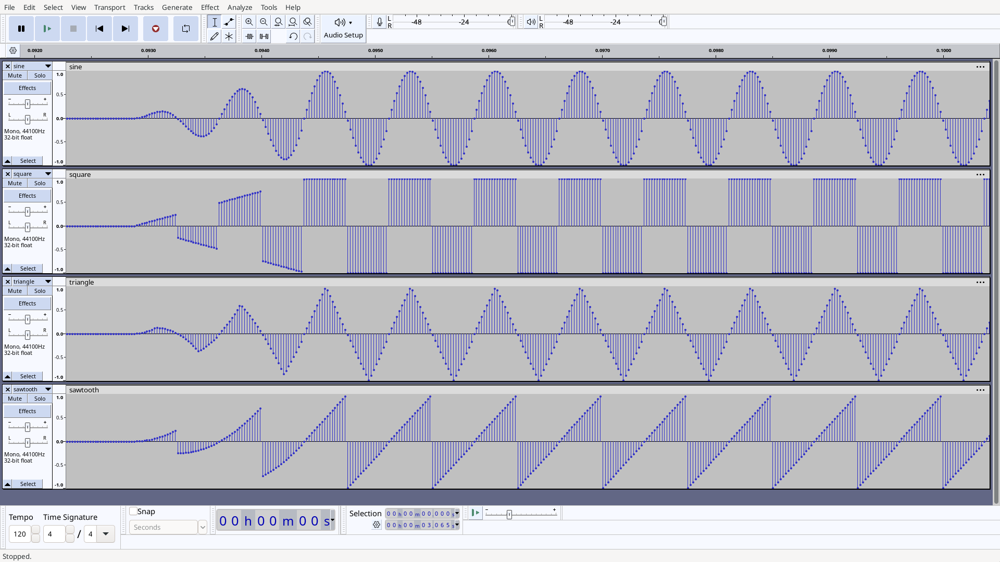

# rattle

simple rtttl player i wrote while learning about sound wave generation

### building:

`brew install sdl2`

`make`

### usage:

* command
```sh
./rattle
```

* output
```sh
usage: ./rattle [-0|-1|-2|-3] [-v] [-f] [-t n] song
    -0    sine
    -1    square
    -2    triangle
    -3    sawtooth
    -v    verbose
    -f    disable fade
    -t n  transpose n steps
```

### sound wave shapes -- sine, square, triangle, sawtooth




### example:
* command
```sh
./rattle -1 -v -t -2 'NokiaTun:d=4,o=5,b=225:8e6,8d6,f#,g#,8c#6,8b,d,e,8b,8a,c#,e,2a'
```

* output
```sh
    name: NokiaTun
defaults: duration = 4, octave = 5, beats = 225
    data: 8e6,8d6,f#,g#,8c#6,8b,d,e,8b,8a,c#,e,2a
  note name: 8d6,    frequency: 1174.66 Hz, duration: 0.1333 s
  note name: 8c6,    frequency: 1046.50 Hz, duration: 0.1333 s
  note name: 4e5,    frequency:  659.26 Hz, duration: 0.2667 s
  note name: 4f#5,   frequency:  739.99 Hz, duration: 0.2667 s
  note name: 8b5,    frequency:  987.77 Hz, duration: 0.1333 s
  note name: 8a5,    frequency:  880.00 Hz, duration: 0.1333 s
  note name: 4c5,    frequency:  523.25 Hz, duration: 0.2667 s
  note name: 4d5,    frequency:  587.33 Hz, duration: 0.2667 s
  note name: 8a5,    frequency:  880.00 Hz, duration: 0.1333 s
  note name: 8g5,    frequency:  783.99 Hz, duration: 0.1333 s
  note name: 4b4,    frequency:  493.88 Hz, duration: 0.2667 s
  note name: 4d5,    frequency:  587.33 Hz, duration: 0.2667 s
  note name: 2g5,    frequency:  783.99 Hz, duration: 0.5333 s
```

* see `tunes.txt` for rtttl songs

#

# keyb

simple keyboard synthesizer

### building:

`brew install sdl2`

`make keyb`

### usage:

`usage: keyb [--sine | --square | --sawtooth | --triangle]`

### key mappings:

```
 _______________________________________________________
|  | | | |  |  | | | | | |  |  | | | |  |  | | | | | |  |
|  | | | |  |  | | | | | |  |  | | | |  |  | | | | | |  |
|  | | | |  |  | | | | | |  |  | | | |  |  | | | | | |  |
|  |_| |_|  |  |_| |_| |_|  |  |_| |_|  |  |_| |_| |_|  |
|   |   |   |   |   |   |   |   |   |   |   |   |   |   |
|   |   |   |   |   |   |   |   |   |   |   |   |   |   |
|___|___|___|___|___|___|___|___|___|___|___|___|___|___|

    2   3       5   6   7       9   0       =   BS              <<-- black keys
  q   w   e   r   t   y   u   i   o   p   [   ]   \             <<-- white keys

 _______________________________________
|  | | | |  |  | | | | | |  |  | | | |  |
|  | | | |  |  | | | | | |  |  | | | |  |
|  | | | |  |  | | | | | |  |  | | | |  |
|  |_| |_|  |  |_| |_| |_|  |  |_| |_|  |
|   |   |   |   |   |   |   |   |   |   |
|   |   |   |   |   |   |   |   |   |   |
|___|___|___|___|___|___|___|___|___|___|

    s   d       g   h   j       l   ;                           <<-- black keys
  z   x   c   v   b   n   m   ,   .   /                         <<-- white keys
```
